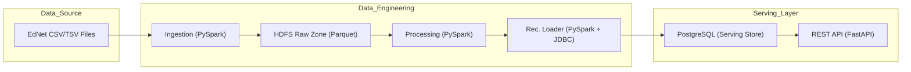

# EdNet Data Engineering Pipeline — Testing Guide

End-to-end pipeline: **File Intake → HDFS Storage → Processing → Serving**.

---

## Prerequisites

| Tool | Version |
|------|---------|
| Docker | 24+ |
| Docker Compose | v2.20+ (compose v2 with `include:` support) |
| RAM | 8 GB+ free for Docker |
| Disk | ~5 GB for images + data |

---

## 1. Get the EdNet Dataset

Download from <https://github.com/riiid/ednet> (CC BY-NC 4.0 license).

**Two** folders are needed:

- **EdNet-KT4/** — directory of per-user TSV files (`u1.csv`, `u2.csv`, …)
- **EdNet-Contents/** — with `contents/lectures.csv` and `contents/questions.csv`

Place them in a `data/` folder at the project root:

```
DataEngineeringProjectIU/
├── data/
│   ├── EdNet-KT4/          ← per-user TSV files here
│   │   ├── u1.csv
│   │   ├── u2.csv
│   │   └── ...
│   └── EdNet-Contents/
│       └── contents/
│           ├── lectures.csv
│           └── questions.csv
├── docker-compose.yml
├── microservices/
└── ...
```

> **Tip — quick test with a subset:** Copy only 10–50 user files from KT4 into `data/EdNet-KT4/` to run a fast test (~2 min). Full dataset takes longer.

---

## 2. Setup

```bash
# 1. Create the shared Docker network (one-time)
docker network create uni_net

# 2. Create .env from template (already done if you have .env)
#    Edit passwords if needed
cp env.example .env
```

---

## 3. Start Infrastructure Services

```bash
# Start HDFS (NameNode + 3 DataNodes) and PostgreSQL
docker compose up -d namenode datanode1 datanode2 datanode3 postgres
```

Wait until all services are healthy:

```bash
# Check health status
docker compose ps
```

You should see `healthy` for namenode and postgres. This usually takes 30–60 seconds.

You can also verify HDFS is accessible via the web UI:
- **NameNode UI**: http://localhost:9870

---

## 4. Run the Full Pipeline (Initial Load)

The initial load script runs all three steps in sequence:

```bash
bash orchestration/scheduler/scripts/initial_load/run_initial_load.sh
```

This executes:

| Step | Service | What it does |
|------|---------|-------------|
| 1/3 | `ingestion` | Reads CSV/TSV → validates → writes Parquet to HDFS raw zone |
| 2/3 | `processing` | Reads HDFS raw → feature engineering → aggregation → similarity → writes to HDFS curated zone |
| 3/3 | `recommendation_loader` | Reads HDFS curated Parquet → loads into PostgreSQL |

Each step is a `docker compose run --rm` command, so containers are removed after completion.

> **Expected time:** ~2–5 min with 10–50 users, ~15–30 min with full dataset (depending on machine).

---

## 5. Verify Results

### 5a. Check HDFS Data

```bash
# List the raw zone
docker exec namenode hdfs dfs -ls /data/raw/kt4/partitions_by_event_date
docker exec namenode hdfs dfs -ls /data/raw/content/lectures
docker exec namenode hdfs dfs -ls /data/raw/content/questions

# List the curated zone
docker exec namenode hdfs dfs -ls /data/curated/aggregated_student_features
docker exec namenode hdfs dfs -ls /data/curated/user_vectors
docker exec namenode hdfs dfs -ls /data/curated/recommendations_batch
```

### 5b. Check PostgreSQL

```bash
# Connect to postgres
docker exec -it postgres psql -U postgres -d recommendations

# Inside psql:
SELECT COUNT(*) FROM recommendations;
SELECT COUNT(*) FROM student_features;

# View some recommendations
SELECT * FROM recommendations LIMIT 10;

# View a specific user's recommendations
SELECT * FROM recommendations WHERE user_id = 'u1' ORDER BY rank;

# Exit psql
\q
```

### 5c. Test the Recommendation API

```bash
# Start the API (if not already running)
docker compose up -d recommendation_api

# Health check
curl http://localhost:8000/health

# Get recommendations for a user (replace u1 with an actual user_id)
curl http://localhost:8000/recommendations/u1

# Get student features
curl http://localhost:8000/students/u1/features

# With custom top_k
curl "http://localhost:8000/recommendations/u1?top_k=5"
```

The API also has auto-generated docs at: http://localhost:8000/docs

---

## 6. Run Individual Steps (Optional)

You can run each pipeline step independently:

```bash
# Just ingestion
docker compose run --rm -e MODE=initial ingestion

# Just processing
docker compose run --rm -e MODE=initial_load processing

# Just the loader
docker compose run --rm -e MODE=initial_load recommendation_loader
```

---

## 7. Tear Down

```bash
# Stop all services and remove containers
docker compose down

# Also remove volumes (HDFS data, PostgreSQL data)
docker compose down -v

# Remove network
docker network rm uni_net
```

---

## Troubleshooting

| Problem | Solution |
|---------|----------|
| `namenode` not healthy | Wait 60s; check `docker logs namenode` |
| Ingestion fails "file not found" | Verify `data/EdNet-KT4/` and `data/EdNet-Contents/` exist with correct structure |
| Processing fails "HDFS path not found" | Run ingestion first — processing reads from HDFS raw zone |
| Loader fails "JDBC connection refused" | Ensure `postgres` container is healthy: `docker compose ps` |
| API returns 404 | Loader hasn't been run yet, or user_id doesn't exist in the dataset |
| Out of memory | Increase Docker memory limit to 8+ GB in Docker Desktop settings |

---

## Architecture


