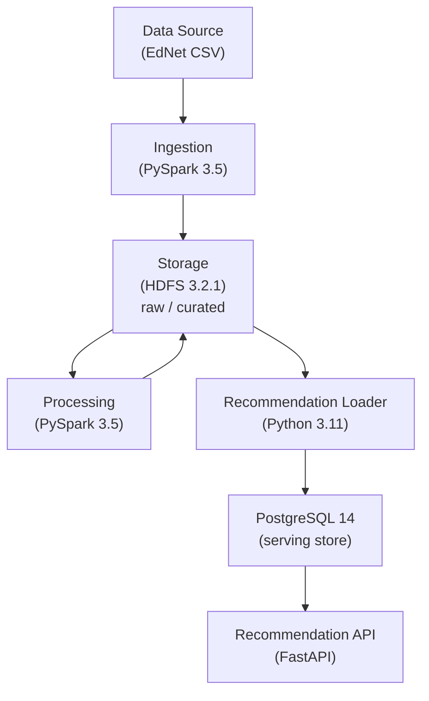
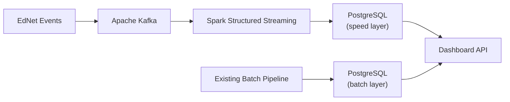

# EdNet Recommendation Pipeline

A microservice-based batch data pipeline that ingests [EdNet](https://github.com/riiid/ednet) learning interaction data, engineers student features, computes peer-similarity recommendations via cosine similarity, and serves them through a JWT-protected REST API. The entire system is containerised and orchestrated with Docker Compose.

---

## Table of Contents

1. [Dataset](#dataset)
2. [Architecture Overview](#architecture-overview)
3. [Microservices & Responsibilities](#microservices--responsibilities)
4. [Service Communication](#service-communication)
5. [Docker Images](#docker-images)
6. [Batch Processing Frequency](#batch-processing-frequency)
7. [Step-by-Step Execution Guide](#step-by-step-execution-guide)
8. [API Endpoints](#api-endpoints)
9. [Project Structure](#project-structure)
10. [Infrastructure as Code](#infrastructure-as-code)
11. [Non-Functional Requirements](#non-functional-requirements)
12. [Strategy for a Real-Time Pipeline (Lambda Architecture)](#strategy-for-a-real-time-pipeline-lambda-architecture)
13. [Workflow Reflection & Future Improvements](#workflow-reflection--future-improvements)
14. [Project Journey](#project-journey)

---

## Dataset

| Property | Value |
|---|---|
| **Name** | EdNet-KT4 |
| **Source** | [github.com/riiid/ednet](https://github.com/riiid/ednet) — CC BY-NC 4.0 licence |
| **Volume** | >100 million time-stamped interaction events across ~780 000 students (~297 000 CSV files) |
| **Time-referenced** | Every record carries a millisecond-precision epoch `timestamp` |
| **Why this dataset** | Exceeds the >1 M data-point requirement; is time-referenced (enabling date-based partitioning and windowed processing); and represents a realistic large-scale learning analytics use case suitable for batch processing and collaborative-filtering recommendations |

A small sample is included in the repository so the pipeline works without downloading the full dataset.

---

## Architecture Overview



Data flows in one direction: **CSV → Ingestion → HDFS → Processing → HDFS → Loader → PostgreSQL → API**.

---

## Microservices & Responsibilities

| # | Microservice | Responsibility | Technology |
|---|---|---|---|
| 1 | **Ingestion** | Reads raw CSV files, validates structure, enforces privacy guardrails, converts to Parquet, writes to HDFS raw zone | PySpark 3.5 |
| 2 | **Storage** (HDFS) | Distributed data lake with raw and curated zones; replication factor 3 for fault tolerance | Hadoop 3.2.1 (1 NameNode + 3 DataNodes) |
| 3 | **Processing** | Reads raw data from HDFS, engineers per-student features, computes cosine similarity, writes recommendation lists to HDFS curated zone | PySpark 3.5 |
| 4 | **Recommendation Loader** | Reads curated Parquet from HDFS and loads it into PostgreSQL (bulk insert or idempotent upsert) | Python 3.11, psycopg2 |
| 5 | **Recommendation API** | JWT-protected REST API serving precomputed recommendations and student features from PostgreSQL | FastAPI + Uvicorn |

Each microservice runs in its own Docker container. See individual `README.md` files inside each microservice folder for implementation details.

---

## Service Communication

Services do **not** call each other via HTTP. They communicate through shared storage:

| Channel | Producer | Consumer |
|---|---|---|
| **HDFS raw zone** | Ingestion | Processing |
| **HDFS curated zone** | Processing | Recommendation Loader |
| **PostgreSQL** | Recommendation Loader | Recommendation API |

All containers run on a single Docker bridge network (`uni_net`) and resolve each other by hostname (e.g. `namenode:9000`, `postgres:5432`). Docker Compose `depends_on` with healthchecks enforces correct startup order.

---

## Docker Images

| Service | Docker Image | Modifications |
|---|---|---|
| NameNode | `bde2020/hadoop-namenode:2.0.0-hadoop3.2.1-java8` | Used as-is |
| DataNode (×3) | `bde2020/hadoop-datanode:2.0.0-hadoop3.2.1-java8` | Used as-is |
| Ingestion | `apache/spark:3.5.1-python3` | Application code + config mounted |
| Processing | `apache/spark:3.5.1-python3` | Application code + config mounted |
| Recommendation Loader | Custom build from `python:3.11-slim` | Dockerfile in `microservices/serving/recommendation_loader/docker/` |
| Recommendation API | Custom build from `python:3.11-slim` | Dockerfile in `microservices/serving/recommendation_api/docker/` |
| PostgreSQL | `postgres:14` | Official image; SQL migration scripts mounted on first boot |

---

## Batch Processing Frequency

| Pipeline | Trigger | Behaviour |
|---|---|---|
| **Initial load** | One-time (`run_initial_load.sh`) | Full historical backfill: ingestion → processing → loader run sequentially |
| **Daily pipeline** | Cron at **02:00 UTC** (`run_daily_pipeline.sh`) | Ingests previous day's data, recomputes features over a 7-day sliding window, refreshes PostgreSQL via idempotent upserts |

The daily pipeline runs automatically via cron. It can also be triggered manually at any time.

---

## Step-by-Step Execution Guide

### Prerequisites

| Requirement | Minimum Version | Verify |
|---|---|---|
| Docker Engine | 24.x+ | `docker --version` |
| Docker Compose | v2.20+ | `docker compose version` |
| Bash | 4.x+ | `bash --version` |

> **Windows users:** run all commands inside **WSL 2** or **Git Bash** with the Docker Desktop WSL 2 backend enabled.

### 1. Clone the repository

```bash
git clone https://github.com/maryemiu/DataEngineeringProjectIU.git
cd DataEngineeringProjectIU
```

### 2. Configure environment variables

```bash
cp .env.example .env
```

Edit `.env` and set secure values for `POSTGRES_PASSWORD`, `JWT_SECRET`, and `API_KEY`:

```bash
# Generate strong secrets:
openssl rand -hex 32   # use for JWT_SECRET
openssl rand -hex 24   # use for API_KEY
```

### 3. (Optional) Add the full EdNet dataset

A small sample is included. For the full dataset, download **EdNet-KT4** from [github.com/riiid/ednet](https://github.com/riiid/ednet) and place files under `data/`.

### 4. Run the pipeline

```bash
./run.sh
```

This single script:
1. Creates the Docker network (`uni_net`)
2. Builds all Docker images
3. Starts long-running services (HDFS, PostgreSQL, API)
4. Waits for all healthchecks to pass
5. Runs ingestion → processing → loader sequentially
6. Validates the system is ready

### 5. Authenticate and query the API

```bash
# Obtain a JWT token
TOKEN=$(curl -s -X POST http://localhost:8000/auth/token \
  -H "Content-Type: application/json" \
  -d '{"user_id":"u1","api_key":"<your-API_KEY-from-.env>"}' \
  | python3 -c 'import sys, json; print(json.load(sys.stdin).get("access_token",""))')

# Fetch recommendations
curl -s -H "Authorization: Bearer $TOKEN" http://localhost:8000/recommendations/u1

# Fetch student features
curl -s -H "Authorization: Bearer $TOKEN" http://localhost:8000/students/u1/features
```

---

## API Endpoints

| Method | Path | Auth | Description |
|---|---|---|---|
| `POST` | `/auth/token` | API key in body | Issues a JWT (valid 24 h) |
| `GET` | `/recommendations/{user_id}` | Bearer JWT | Top-K most similar students (default 10, max 50) |
| `GET` | `/students/{user_id}/features` | Bearer JWT | Aggregated learning features for a student |
| `GET` | `/health` | None | Liveness probe (used by Docker healthchecks) |

---

## Project Structure

```
├── docker-compose.yml          # Root compose — includes all service files
├── run.sh                      # Single entry-point script
├── .env.example                # Environment variable template
│
├── microservices/
│   ├── ingestion/              # CSV → validated Parquet → HDFS raw zone
│   ├── processing/             # HDFS raw → features → similarity → HDFS curated
│   ├── storage/                # HDFS cluster configuration & zone definitions
│   └── serving/
│       ├── recommendation_loader/  # HDFS curated → PostgreSQL
│       └── recommendation_api/     # FastAPI REST API (JWT-protected)
│
├── orchestration/              # Docker Compose files, healthchecks, cron scheduler
│   ├── docker_compose/         # Per-service compose files (storage, ingestion, processing, serving)
│   ├── healthchecks/           # Shell-based healthcheck scripts for every service
│   ├── network/                # Docker network definition (uni_net)
│   └── scheduler/              # Cron schedule + pipeline trigger scripts
│
├── serving_store/
│   └── postgres/               # SQL migrations & seeds for PostgreSQL
│
├── shared/
│   └── schema_contracts/       # Cross-service data-format contracts (JSON Schema)
│
├── data/                       # Source dataset (EdNet-KT4 + contents)
├── data_source/                # Staging area for pipeline input files
└── data_lake/                  # Local HDFS data (raw + curated zones)
```

Each directory contains its own `README.md` with details specific to that component.

---

## Infrastructure as Code

Everything is defined in version-controlled files. No manual configuration is required.

| Artefact | Purpose |
|---|---|
| `docker-compose.yml` + `orchestration/docker_compose/*.yml` | All services, networks, volumes, healthchecks, restart policies |
| `microservices/*/docker/Dockerfile` | Builds each microservice image (pinned base images) |
| `serving_store/postgres/migrations/*.sql` | Versioned schema migrations auto-applied on first boot |
| `orchestration/healthchecks/*.sh` | Docker healthcheck scripts for every service |
| `orchestration/scheduler/cron/crontab` | Cron schedule for the daily pipeline |
| `run.sh` | Single entry-point: builds, starts, waits, validates |
| `.env.example` | Documents all required environment variables |
| `.github/workflows/*.yml` | CI/CD pipeline — linting, testing, image builds, and integration checks on every push |

**Reproducibility:** clone the repository → `cp .env.example .env` → `bash run.sh`. The system is fully transferable to any machine with Docker.

---

## Non-Functional Requirements

### Fault Tolerance & Reliability

| Mechanism | Where | Purpose |
|---|---|---|
| Retry with exponential backoff | Ingestion & processing (HDFS I/O) | Handles transient network errors without crashing |
| HDFS replication factor 3 | Storage — each block on 3 DataNodes | Tolerates up to 2 simultaneous node failures |
| Docker healthchecks on every service | Orchestration — `depends_on` with condition | Services start only when dependencies are healthy |
| Restart policy `unless-stopped` | Long-running services (HDFS, PostgreSQL, API) | Automatic recovery from crashes |
| Idempotent writes | Ingestion (overwrite/append), Loader (upsert) | Safe to re-run without creating duplicates |
| SHA-256 checksum verification | Ingestion | Detects corrupt or tampered source files |
| Structural & data-quality gates | Ingestion (null ratio ≤ 5 %, required columns), Processing (PK uniqueness, min rows) | Rejects bad data before it propagates |

### Scalability

| Mechanism | Where | Purpose |
|---|---|---|
| Distributed Spark processing | Ingestion & processing — AQE, dynamic allocation (1–10 executors) | Parallelises work across CPU cores |
| Partitioning by `event_date` | KT4 data in HDFS raw zone | Reads only relevant partitions |
| Snappy-compressed Parquet | All persisted data | ~70 % smaller than CSV; columnar I/O |
| File compaction (~128 MB) | Ingestion | Reduces NameNode metadata overhead |
| Windowed processing (last N days) | Processing | Avoids full-history recomputation on daily runs |
| HDFS horizontal scaling | Storage | Add DataNodes without downtime |
| PostgreSQL connection pooling | API (1–10 connections) | Prevents connection exhaustion |
| Precomputed recommendations | API | Sub-millisecond lookups; no real-time compute |

### Maintainability

| Mechanism | Where | Purpose |
|---|---|---|
| Modular pipeline stages | Ingestion (5 stages), processing (4 stages) | Each stage is independently testable |
| YAML-driven configuration | Every microservice | Change behaviour without modifying code |
| Structured JSON logging | All microservices | Machine-parsable, searchable logs |
| Lineage audit trail | Ingestion & processing | JSON records with row counts, schemas, timestamps per run |
| Schema contracts | `shared/schema_contracts/` | Cross-service data-format agreements |
| Version control (Git) | All code, Dockerfiles, configs | Full history and traceability |

### Data Security, Governance & Privacy

| Mechanism | Where | Purpose |
|---|---|---|
| JWT authentication (HS256, 24 h TTL) | API — all data endpoints | Only authenticated users access data |
| API-key gating | Token issuance (`POST /auth/token`) | Controls who can obtain tokens |
| Token-scoped access | API — `sub` claim must match `{user_id}` | Users can only query their own data |
| HDFS file permissions | Raw zone: 755, Curated zone: 750 | RBAC-based access control on the data lake |
| Container isolation | Each microservice in its own container; no host networking | Limits blast radius of a compromised service |
| Secrets via environment variables | `.env` file (gitignored) | Passwords and keys never committed to code |
| PII scanning + column allowlists | Ingestion and processing | Detects and removes sensitive columns automatically |
| Anonymised data only | Entire pipeline | Only `user_id` values and numerical scores are stored and served |
| Immutable raw zone | HDFS `/data/raw` | Source data is never modified after write |
| Retention policies | Raw: 365 days, Curated: 180 days | Enforced automatically by the storage microservice |
| Schema versioning | `shared/schema_contracts/` | Prevents silent format drift between services |
| Lineage tracking | Ingestion & processing | Every pipeline run is auditable end-to-end |

---

## Strategy for a Real-Time Pipeline (Lambda Architecture)

The current system is a **batch pipeline** — recommendations refresh once daily. Student learning patterns shift over days and weeks, not seconds, so real-time recommendation updates would add complexity without meaningful value. A more practical real-time complement is a **live engagement dashboard**.

### Proposed Architecture



1. **Streaming ingestion** — Apache Kafka acts as a message broker. A lightweight producer publishes EdNet interaction events as they arrive.
2. **Stream processing** — A Spark Structured Streaming job consumes from Kafka and computes rolling engagement metrics: active users per hour, average accuracy trends, response-time distributions, interaction volume by question category.
3. **Speed layer** — Aggregated metrics are written to a dedicated PostgreSQL table (separate from the batch recommendation tables), updated every few seconds.
4. **Dashboard API** — A new endpoint serves live engagement metrics for administrators and instructors, merged with batch-layer statistics for historical context.
5. **Batch layer unchanged** — The existing daily recommendation pipeline continues independently. The two pipelines share the Kafka topic but serve different purposes: batch for recommendations, streaming for operational visibility.

This approach follows the Lambda architecture pattern — a batch layer for deep analytics and a speed layer for low-latency operational metrics — without forcing real-time updates where they add no value.

---

## Workflow Reflection & Future Improvements

### What Worked Well

- **Docker-first approach** — defining all infrastructure as code from the start made the system reproducible and eliminated "works on my machine" issues.
- **Modular pipeline stages** — isolating each stage (file intake, validation, feature engineering, similarity, loading) made debugging straightforward: failures were traceable to a specific module.
- **Schema contracts** — agreeing on data formats early prevented integration issues between microservices.

### What Could Be Improved

| Area | Current State | Improvement |
|---|---|---|
| **Monitoring** | Docker healthchecks only | Integrate Prometheus + Grafana for metrics (latency, throughput, error rates) and alerting |
| **Testing** | Unit tests for API; limited coverage elsewhere | Add integration tests for the full pipeline; test data-quality gates with intentionally bad input |
| **Secret management** | `.env` file | Use Docker Secrets or a vault (HashiCorp Vault) for production credentials |
| **Data versioning** | Schema contracts (JSON) | Add DVC or Delta Lake for versioned datasets and schema evolution tracking |
| **API rate limiting** | None | Add rate limiting middleware to prevent abuse |


---

## Project Journey

### Major Steps

1. **Conception** — Selected the EdNet dataset, designed the microservice architecture, defined schema contracts, and planned the zone architecture (raw/curated).
2. **Data layer** — Set up the HDFS cluster (NameNode + 3 DataNodes) with Docker Compose, configured replication, access control, and retention policies.
3. **Ingestion pipeline** — Built 5-stage PySpark pipeline: file intake → structural validation → privacy guardrails → format conversion → HDFS write.
4. **Processing pipeline** — Built 4-stage PySpark pipeline: data intake → feature engineering → aggregation → cosine similarity computation.
5. **Serving layer** — Implemented the recommendation loader (HDFS → PostgreSQL) and the FastAPI REST API with JWT authentication.
6. **Orchestration** — Wired all services via Docker Compose `include:`, wrote healthcheck scripts, created pipeline trigger scripts, configured cron scheduling.
7. **Finalization** — Removed dead code, fixed all integration issues, verified end-to-end data flow, confirmed reproducibility.

### Challenges & How They Shaped the Design

**1. Data quality at scale.** EdNet contains ~297 000 CSV files from ~780 000 students. Not all files are clean — some have missing columns, null-heavy rows, or unexpected fields. Building a pipeline that blindly trusts its input would produce garbage recommendations. The solution was a **two-layer validation architecture**: structural validation at ingestion (required columns, null-ratio thresholds ≤ 5%, minimum row counts, type casting with corrupt-row quarantine) and data-quality gates at processing (duplicate primary key detection, null-ratio re-checks at 10%, schema conformance). Data that fails either gate is rejected before it can pollute downstream outputs.

**2. Cross-service integration in a distributed system.** In a microservice pipeline, bugs rarely live inside a single service — they live at the boundaries. A column that processing produces but the SQL migration doesn't define, a mode string that a shell script passes but Python argparse doesn't accept, a schema that drifts between what ingestion writes and processing reads. These integration gaps are invisible to unit tests. This led to **schema contracts** (`shared/schema_contracts/`) that make cross-service data formats explicit and version-controlled, and to a **fail-fast configuration philosophy** — every service raises immediately on missing environment variables or invalid config, rather than falling back to silent defaults that mask the real problem.

**3. HDFS small-file problem.** Ingesting hundreds of thousands of small CSV files into HDFS creates excessive NameNode metadata overhead and degrades read performance for Spark. The pipeline addresses this with **file compaction** at ingestion (~128 MB target) and **Snappy-compressed Parquet** conversion, reducing storage by ~70% and turning many small files into a manageable number of columnar blocks.

**4. Cosine similarity at scale.** Computing pairwise similarity across all students requires a self-join — an $O(n^2)$ operation that can easily exhaust memory. The implementation uses **min-max normalised feature vectors**, a **filtered self-join** (`a.user_id < b.user_id` to halve the pairs), and Spark's **Adaptive Query Execution** (AQE) to dynamically optimise shuffle partitions. The result is mirrored to ensure every user appears in the `user_id` column, then **windowed Top-K ranking** keeps only the most relevant neighbours per student.

**5. Privacy guardrails as code.** The EdNet dataset uses anonymised `user_id` values, but a pipeline built only for today's data is fragile. If the source format changes or new columns appear, PII could leak into the data lake silently. The system enforces privacy at two layers: **column allowlists** that drop any column not explicitly approved, and **regex-based PII scanning** that flags column names matching patterns like email, name, phone, or IP address. Both checks run at ingestion *and* processing, providing defence in depth.

**6. Container orchestration and health.** Six long-running containers must start in the correct order (HDFS before Spark, PostgreSQL before the API), and failures must be detectable. Every service has a dedicated **healthcheck script** — NameNode checks its Web UI, DataNodes verify live-node counts via JMX, PostgreSQL uses `pg_isready`, the API checks its `/health` endpoint. Docker Compose `depends_on` with `condition: service_healthy` gates the startup sequence, and `restart: on-failure` handles transient crashes.

### Lessons Learned

- **Validate data at every boundary, not just at ingest.** Running quality checks only at entry gives a false sense of safety. Feature engineering can introduce nulls, type changes, or duplicates that didn't exist in the raw data. Validating again before writing to the curated zone catches these.
- **The self-join is the bottleneck — design around it.** Pairwise similarity is the most expensive operation in the pipeline. Reducing feature dimensions, filtering the join condition, and leaning on Spark's AQE delivered more impact than generic Spark tuning.
- **Immutability simplifies debugging.** Making the raw zone append-only means you can always replay the pipeline from source data. When processing logic changes, the raw zone is unchanged — you reprocess, not re-ingest.
- **Retry with exponential backoff is essential for HDFS writes.** Transient NameNode unavailability during container startup caused early pipeline failures. Wrapping writes with `@retry(max_retries=3, backoff_sec=2, backoff_factor=2)` resolved this without adding complexity.
- **Dead code is a liability.** Unused modules (like an abandoned async API variant) confused tests, created false import errors, and made the codebase harder to reason about. Deleting unused code immediately is cheaper than debugging its side effects later.

### Technical Skills Acquired

1. **Distributed data engineering** — Designing and operating an end-to-end pipeline with HDFS, Spark, and PostgreSQL across multiple containers.
2. **Docker Compose orchestration** — Managing multi-service dependencies with healthchecks, restart policies, network isolation, and `include:` composition.
3. **API security implementation** — Building JWT authentication with token-scoping, API-key gating, and secrets management.

### Soft Skills Acquired

1. **Systematic debugging** — Learned to trace issues across service boundaries by reading logs, checking healthchecks, and validating data at each stage.
2. **Documentation discipline** — Writing clear READMEs and schema contracts forced precise thinking about interfaces and made the system easier to maintain.
3. **Scope management** — Prioritising a working end-to-end pipeline over feature completeness kept the project deliverable within the timeline.

