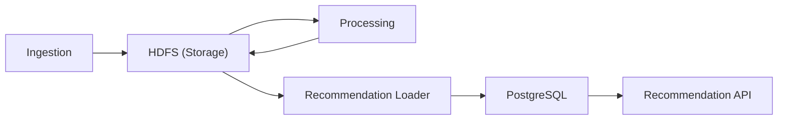

# Microservices

This directory contains all five microservices that compose the data pipeline. Each runs in its own Docker container.

```
microservices/
├── ingestion/              # Stage 1: CSV → validated Parquet → HDFS raw zone
├── processing/             # Stage 3: HDFS raw → feature engineering → similarity → HDFS curated
├── storage/                # Stage 2: HDFS cluster (1 NameNode + 3 DataNodes) — data lake
└── serving/
    ├── recommendation_loader/  # Stage 4: HDFS curated → PostgreSQL
    └── recommendation_api/     # Stage 5: JWT-protected REST API serving recommendations
```

## Pipeline Flow



## Per-Service Details

| Microservice | Technology | What It Does |
|---|---|---|
| [ingestion](ingestion/) | PySpark 3.5 | Validates, converts, and writes raw data to HDFS |
| [storage](storage/) | Hadoop 3.2.1 | Distributed file system with raw/curated zones |
| [processing](processing/) | PySpark 3.5 | Engineers features, computes cosine similarity |
| [recommendation_loader](serving/recommendation_loader/) | Python 3.11 | Loads results from HDFS into PostgreSQL |
| [recommendation_api](serving/recommendation_api/) | FastAPI + Uvicorn | Serves recommendations via REST endpoints |

Each microservice has its own `README.md` with implementation details, configuration, and non-functional requirements.
