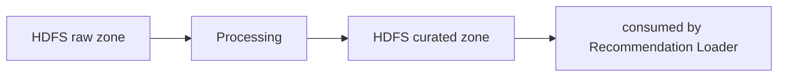

# Processing Microservice

**Role in the pipeline:** Reads validated raw data from HDFS, engineers per-student learning features, computes cosine similarity between students, and writes Top-K recommendation lists to the HDFS curated zone.

---

## Pipeline Stages

The orchestrator (`pipelines/process_ednet.py`) drives data through four stages:

### 1. Data Intake — `pipelines/data_intake/`

Reads Parquet files from the HDFS raw zone. KT4 is mandatory. In **incremental (daily) mode**, only the last N days are read (configurable via `PROCESSING_WINDOW_DAYS`). Reads are retry-wrapped (3 attempts, exponential backoff).

### 2. Feature Engineering — `pipelines/feature_engineering/`, `src/feature_builder.py`

Enriches each interaction row with derived columns:

| Feature | Computation |
|---|---|
| `is_correct` | 1 if answered correctly, 0 otherwise |
| `response_time_ms` | Time to answer, capped at 300 000 ms (5 min) to remove outliers |
| `hour_of_day` | Extracted from timestamp |
| `day_of_week` | Extracted from timestamp |
| `part` | Question category (joined from questions metadata) |

### 3. Feature Aggregation — `pipelines/feature_aggregation/`, `src/aggregator.py`

Condenses millions of per-interaction rows into **one summary row per student**:

| Aggregated Feature | Meaning |
|---|---|
| `accuracy_rate` | Proportion of correct answers |
| `avg_response_time_ms` | Average response time |
| `total_interactions` | Total learning volume |
| `unique_questions_attempted` | Breadth of practice |
| `unique_lectures_viewed` | Lecture engagement |
| `active_days` | Distinct days active |
| Per-part counts | Interaction breakdown by question category |

Students with < 5 interactions are filtered out (insufficient data for meaningful recommendations).

### 4. Similarity Computation — `pipelines/similarity_computation/`, `src/similarity.py`

1. **Normalise** features to 0–1 range
2. **Cosine similarity** between student feature vectors (1.0 = identical patterns, 0.0 = completely different)
3. **Top-K selection** — retains only the K most similar peers per student (default K = 10)

---

## Outputs (HDFS curated zone)

| Dataset | Description |
|---|---|
| `aggregated_student_features` | One row per student — 17 feature columns |
| `user_vectors` | Normalised feature vectors (6 core features) |
| `recommendations_batch` | `user_id`, `recommended_user_id`, `similarity_score`, `rank` |

---

## Cross-Cutting Modules

| Module | Purpose |
|---|---|
| `src/privacy.py` | PII scan + column allowlists on every output dataset |
| `src/data_quality.py` | Validates null ratio (≤ 10 %), PK uniqueness, minimum row count before writing |
| `src/lineage.py` | Tracks row counts, schemas, timestamps per run |
| `src/retry.py` | Exponential backoff on HDFS operations |
| `src/config_loader.py` | Reads and validates YAML config at startup |

---

## Configuration

`config/processing_config.yaml` — Spark settings (AQE, Kryo serialiser, shuffle partitions), feature engineering toggles, aggregation thresholds, similarity method, Top-K value, processing window, data-quality thresholds, privacy allowlists.

---

## Non-Functional Requirements

| Category | Implementation |
|---|---|
| **Reliability** | Retry-wrapped HDFS reads (3 retries, exponential backoff); data-quality gates (null ratio, PK uniqueness, min rows); idempotent overwrite to curated zone |
| **Scalability** | Distributed Spark with AQE + Kryo; windowed processing (last N days); Parquet output |
| **Maintainability** | Modular pipeline (one folder per stage); YAML config; JSON lineage audit trail |
| **Security** | Secrets via env vars; isolated Docker container on `uni_net` |
| **Privacy** | PII scan + column allowlists on all 3 output datasets; only anonymised `user_id` and numerical scores stored |
| **Governance** | Feature lineage (input → output row counts); data-quality validation before write; schema contract enforcement |
