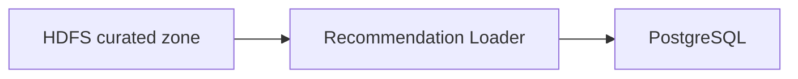

# Recommendation Loader

**Role in the pipeline:** Bridge between the data lake and the serving database — reads precomputed results from HDFS and loads them into PostgreSQL so the REST API can serve them.

---

## Data Flow

| Source (HDFS) | Target (PostgreSQL) | Contents |
|---|---|---|
| `recommendations_batch/` | `recommendations` table | `user_id`, `recommended_user_id`, `similarity_score`, `rank` |
| `aggregated_student_features/` | `student_features` table | `user_id` + 17 aggregated learning features |

---

## Load Modes

| Mode | Behaviour | Trigger |
|---|---|---|
| **Initial** | `TRUNCATE` + bulk insert (full refresh) | First-time setup (`run_initial_load.sh`) |
| **Daily** | Idempotent upsert (`INSERT ... ON CONFLICT DO UPDATE`) | Daily pipeline (`run_daily_pipeline.sh`) |

Upserts are idempotent: running the same load twice produces the same result, preventing duplicates on retry.

---

## Implementation

Two loader variants (same result):

| Variant | Reader | Writer | Module | Best for |
|---|---|---|---|---|
| **Spark-based** | PySpark Parquet | JDBC DataFrame (bulk) | `pipelines/load_to_postgres.py` | Large datasets (distributed I/O) |
| **PyArrow-based** | `pyarrow.fs.HadoopFileSystem` | `psycopg2` + `execute_values` (5 000-row batches) | `pipelines/load_recommendations.py` | Smaller datasets (lighter footprint) |

### Key Modules

| Module | Purpose |
|---|---|
| `src/reader.py` | Spark-based Parquet reader |
| `src/writer.py` | Spark-based JDBC writer |
| `src/hdfs_reader.py` | PyArrow-based Parquet reader |
| `src/postgres_writer.py` | psycopg2 batch writer (5 000 rows per insert) |

---

## Configuration

- `config/loader_config.yaml` — Spark memory, HDFS source paths, PostgreSQL JDBC URL, batch size, write mode
- Credentials via environment variables: `POSTGRES_USER`, `POSTGRES_PASSWORD`

---

## Non-Functional Requirements

| Category | Implementation |
|---|---|
| **Reliability** | Idempotent upserts for daily loads (safe to retry); `TRUNCATE` + bulk insert for initial; 5 000-row batches prevent OOM |
| **Scalability** | Configurable batch size; JDBC bulk writes (Spark variant); processes large datasets without full memory load |
| **Maintainability** | Two loader variants for flexibility; YAML config; clear reader/writer separation |
| **Security** | PostgreSQL credentials via env vars; isolated Docker container on `uni_net` |
| **Privacy** | Only anonymised `user_id` and numerical scores loaded; no PII enters PostgreSQL |
| **Governance** | `generation_date` attached to every recommendation; load mode logged for auditability |
