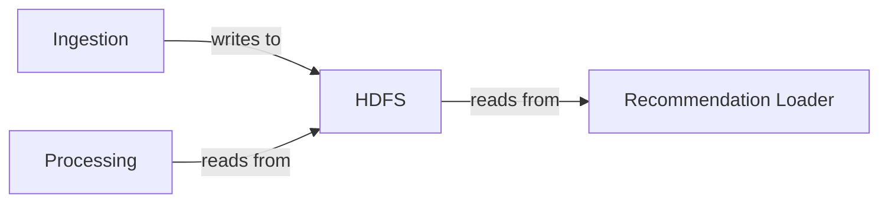

# Storage Microservice (HDFS)

**Role in the pipeline:** Central data lake — stores both raw incoming data and processed results. Every other microservice either writes to or reads from HDFS.

---

## HDFS Cluster

| Component | Count | Role |
|---|---|---|
| NameNode | 1 | File-system metadata: which files exist, which blocks compose each file, which DataNodes hold each block |
| DataNode | 3 | Store actual data blocks (128 MB each) |

- **Replication factor: 3** — every block is stored on 3 DataNodes; the cluster tolerates up to 2 simultaneous node failures
- **Block size: 128 MB** — optimised for large sequential reads
- **Docker images:** `bde2020/hadoop-namenode` / `bde2020/hadoop-datanode` (Hadoop 3.2.1)

---

## Zone Architecture

### Raw Zone — `/data/raw` (immutable, append-only)

| Path | Contents |
|---|---|
| `/data/raw/kt4/` | KT4 interaction events, partitioned by `event_date` |
| `/data/raw/content/questions/` | Question metadata |
| `/data/raw/content/lectures/` | Lecture metadata |

Raw data is never modified or deleted after write. This guarantees the system can always reprocess from the original source of truth.

### Curated Zone — `/data/curated` (derived, overwritten each batch)

| Path | Contents |
|---|---|
| `/data/curated/aggregated_student_features/` | Per-student feature profiles |
| `/data/curated/user_vectors/` | Normalised feature vectors |
| `/data/curated/recommendations_batch/` | Precomputed recommendation lists |

---

## Key Modules

| Module | Purpose |
|---|---|
| `src/zone_manager.py` | Defines zones/datasets, enforces immutability, initialises directories |
| `src/hdfs_client.py` | WebHDFS REST API wrapper (mkdir, status, chmod, chown, JMX health) |
| `src/access_control.py` | RBAC permissions: raw 755 (world-readable), curated 750 (group-only) |
| `src/path_resolver.py` | Translates logical dataset names to full HDFS paths |
| `src/replication_manager.py` | Monitors replication status; adjusts if a DataNode fails |
| `src/retention_policy.py` | Enforces retention: raw 365 days, curated 180 days |

---

## Configuration

`config/storage_config.yaml` — cluster nodes, replication factor, block size, zone paths, access permissions, retention policies.

---

## Non-Functional Requirements

| Category | Implementation |
|---|---|
| **Reliability** | Replication factor 3; safe-mode threshold 0.999; DataNode heartbeat every 3 s detects failures within seconds |
| **Scalability** | Add DataNodes without downtime; parallel reads via Spark; 128 MB block size for large sequential I/O |
| **Maintainability** | Clear raw/curated zone separation; zone manager enforces naming and immutability conventions |
| **Security** | RBAC via HDFS file permissions (raw 755, curated 750); encryption at rest via HDFS KMS |
| **Privacy** | No PII is stored — enforced upstream at ingestion via column allowlists |
| **Governance** | Immutable raw zone; retention policies (raw 365 d, curated 180 d) enforced daily; replication monitoring ensures durability |
