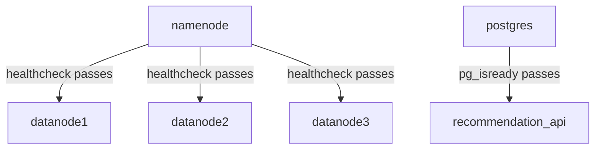

# Orchestration Layer

Infrastructure configuration only — no business logic. Manages Docker Compose, networking, healthchecks, and scheduling.

---

## Responsibilities

| Concern | Implementation |
|---|---|
| Networking | Single Docker bridge network (`uni_net`) shared by all containers |
| Service composition | Docker Compose files — one per service group, wired via `include:` |
| Startup order | `depends_on` + healthchecks enforce correct boot sequence |
| Restart policies | Long-running services: `unless-stopped`; batch jobs: none |
| Scheduling | Cron triggers the daily pipeline at 02:00 UTC |
| Health monitoring | Per-service shell scripts used as Docker healthchecks |

---

## Folder Structure

```
orchestration/
├── network/
│   └── network.yml                    # Shared Docker bridge network
├── docker_compose/
│   ├── storage.yml                    # HDFS (1 NameNode + 3 DataNodes)
│   ├── ingestion.yml                  # PySpark ingestion batch job
│   ├── processing.yml                 # Spark processing batch job
│   └── serving.yml                    # PostgreSQL + Loader + FastAPI
├── healthchecks/
│   ├── namenode.healthcheck.sh        # curl http://namenode:9870
│   ├── datanode.healthcheck.sh        # NameNode JMX live-node count
│   ├── postgres.healthcheck.sh        # pg_isready
│   ├── api.healthcheck.sh             # curl /health on FastAPI
│   ├── ingestion.healthcheck.sh       # Spark driver PID / clean exit
│   ├── processing.healthcheck.sh      # Spark driver PID / clean exit
│   └── loader.healthcheck.sh          # Python PID / clean exit
└── scheduler/
    ├── cron/
    │   └── crontab                    # 0 2 * * * daily pipeline
    └── scripts/
        ├── initial_load/
        │   └── run_initial_load.sh    # One-time full load
        └── daily_pipeline/
            └── run_daily_pipeline.sh  # Daily incremental pipeline
```

The root `docker-compose.yml` wires all compose files via `include:` (requires Compose v2.20+).

---

## Prerequisites

| Requirement | Minimum | Verify |
|---|---|---|
| Docker Engine | 24.x+ | `docker --version` |
| Docker Compose | v2.20+ | `docker compose version` |
| Bash | 4.x+ | `bash --version` |

---

## Environment Variables

Copy `.env.example` → `.env` at the project root before running.

| Variable | Default | Required | Description |
|---|---|---|---|
| `POSTGRES_USER` | `postgres` | Yes | PostgreSQL username |
| `POSTGRES_PASSWORD` | `changeme` | **Yes — change** | PostgreSQL password |
| `POSTGRES_DB` | `recommendations` | Yes | Database name |
| `JWT_SECRET` | `changeme` | **Yes — change** | API auth secret |
| `API_KEY` | `changeme` | **Yes — change** | API key for token issuance |
| `PROCESSING_WINDOW_DAYS` | `7` | No | Days of history recomputed |

---

## Starting the System

Start long-running services only — batch jobs are triggered by the scheduler:

```bash
docker compose up -d namenode datanode1 datanode2 datanode3 postgres recommendation_api
```

### Startup Order



First boot: NameNode needs 60–120 s to format. Verify with `docker compose ps` — all services should show `Up (healthy)`.

---

## Running the Pipeline

### Initial Load (one-time)

```bash
bash orchestration/scheduler/scripts/initial_load/run_initial_load.sh
```

Runs: `ingestion (MODE=initial)` → `processing (MODE=initial)` → `loader (MODE=initial)`. Each step must exit 0 before the next begins.

### Daily Pipeline (cron)

Runs automatically at **02:00 UTC**. Manual trigger:

```bash
bash orchestration/scheduler/scripts/daily_pipeline/run_daily_pipeline.sh
```

Runs: `ingestion (MODE=daily)` → `processing (MODE=incremental)` → `loader (MODE=incremental)`.

Override processing window: `PROCESSING_WINDOW_DAYS=14 bash orchestration/scheduler/scripts/daily_pipeline/run_daily_pipeline.sh`

---

## Service Reference

| Service | Compose File | Image | Ports | Type |
|---|---|---|---|---|
| `namenode` | `storage.yml` | `bde2020/hadoop-namenode:2.0.0-hadoop3.2.1-java8` | 9870, 9000 | Always-on |
| `datanode1/2/3` | `storage.yml` | `bde2020/hadoop-datanode:2.0.0-hadoop3.2.1-java8` | — | Always-on |
| `postgres` | `serving.yml` | `postgres:14` | 5432 | Always-on |
| `recommendation_api` | `serving.yml` | Custom (`python:3.11-slim`) | 8000 | Always-on |
| `ingestion` | `ingestion.yml` | Custom (`spark:3.x`) | — | Batch job |
| `processing` | `processing.yml` | Custom (`spark:3.x`) | — | Batch job |
| `recommendation_loader` | `serving.yml` | Custom (Python) | — | Batch job |

**Always-on** services use `restart: unless-stopped`. **Batch jobs** have no restart policy — triggered via `docker compose run --rm`.

---

## Healthchecks

| Script | Interval | What It Tests |
|---|---|---|
| `namenode.healthcheck.sh` | 30 s | HTTP 200 from NameNode Web UI |
| `datanode.healthcheck.sh` | 30 s | ≥ 1 DataNode in NameNode JMX |
| `postgres.healthcheck.sh` | 10 s | `pg_isready` returns success |
| `api.healthcheck.sh` | 30 s | HTTP 200 from `GET /health` |
| `ingestion.healthcheck.sh` | On demand | Spark driver PID alive or clean exit |
| `processing.healthcheck.sh` | On demand | Spark driver PID alive or clean exit |
| `loader.healthcheck.sh` | On demand | Python PID alive or clean exit |

---

## Stopping & Resetting

```bash
docker compose stop                   # stop all (keep state)
docker compose down                   # stop + remove containers (volumes kept)
docker compose down -v                # destroy all data (full reset)
docker network rm uni_net             # remove shared network
```

---

## Troubleshooting

| Problem | Likely Cause | Fix |
|---|---|---|
| DataNodes stay unhealthy | NameNode still initialising (60–120 s) | Wait for NameNode `(healthy)`, check `docker compose logs datanode1` |
| NameNode stuck in `starting` | Port 9870 in use or corrupt volume | `lsof -i :9870` / `docker compose down -v && docker compose up -d namenode` |
| PostgreSQL exits immediately | Stale volume from different credentials | `docker compose down -v && docker compose up -d postgres` |
| Pipeline fails at step N | Microservice error | `docker compose logs ingestion` (or `processing` / `recommendation_loader`) |
| `uni_net` not found | Network not created | `docker network create uni_net` |
| `unknown key: include` | Compose < v2.20 | Upgrade Docker Compose |
