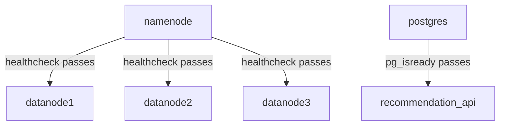
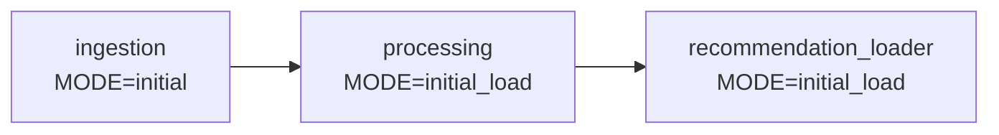
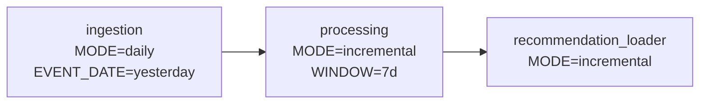

# Orchestration Layer

> Infrastructure configuration only — no business logic.
> Docker, networking, health checks, and scheduling.

---

## What This Layer Does

| Concern | Implementation |
|---|---|
| **Networking** | Single Docker bridge network (`uni_net`) shared by all containers |
| **Service Composition** | Docker Compose files — one per service group |
| **Startup Order** | `depends_on` + healthchecks enforce correct boot sequence |
| **Restart Policies** | Long-running services: `unless-stopped`; batch jobs: none |
| **Scheduling** | Cron triggers the daily pipeline at 02:00 UTC |
| **Health Monitoring** | Per-service shell scripts used as Docker healthchecks |

---

## Prerequisites

| Requirement | Minimum | Check |
|---|---|---|
| Docker Engine | 24.x+ | `docker --version` |
| Docker Compose | v2.20+ | `docker compose version` |
| Bash | 4.x+ | `bash --version` |

> **Windows:** run all bash scripts inside **WSL2** or **Git Bash** with
> Docker Desktop WSL2 backend enabled.

---

## Folder Structure

```
orchestration/
├── network/
│   └── network.yml                    ← shared Docker bridge network
├── docker_compose/
│   ├── storage.yml                    ← HDFS (1 NameNode + 3 DataNodes)
│   ├── ingestion.yml                  ← PySpark ingestion batch job
│   ├── processing.yml                 ← Spark processing batch job
│   └── serving.yml                    ← PostgreSQL + Loader + FastAPI
├── healthchecks/
│   ├── namenode.healthcheck.sh        ← curl http://namenode:9870
│   ├── datanode.healthcheck.sh        ← NameNode JMX live-node count
│   ├── postgres.healthcheck.sh        ← pg_isready
│   ├── api.healthcheck.sh             ← curl /health on FastAPI
│   ├── ingestion.healthcheck.sh       ← Spark driver PID / clean exit
│   ├── processing.healthcheck.sh      ← Spark driver PID / clean exit
│   └── loader.healthcheck.sh          ← Python PID / clean exit
└── scheduler/
    ├── cron/
    │   └── crontab                    ← 0 2 * * * daily pipeline
    └── scripts/
        ├── initial_load/
        │   └── run_initial_load.sh    ← Script A: one-time full load
        └── daily_pipeline/
            └── run_daily_pipeline.sh  ← Script B: daily incremental
```

The root `docker-compose.yml` wires all compose files together via `include:`.

---

## Environment Variables

Copy `.env.example` → `.env` at the project root before running anything.

| Variable | Default | Required | Description |
|---|---|---|---|
| `POSTGRES_USER` | `postgres` | Yes | PostgreSQL username |
| `POSTGRES_PASSWORD` | `changeme` | **Yes — change** | PostgreSQL password |
| `POSTGRES_DB` | `recommendations` | Yes | Database name |
| `JWT_SECRET` | `changeme` | **Yes — change** | API auth secret |
| `PROCESSING_WINDOW_DAYS` | `7` | No | Days of history recomputed |

> **Security:** never commit `.env`. Generate a secret with
> `openssl rand -hex 32`.

---

## First-Time Setup

```bash
# 1. Create the shared Docker network (once)
docker network create uni_net

# 2. Configure environment
cp .env.example .env          # then edit POSTGRES_PASSWORD + JWT_SECRET

# 3. Pull images
docker compose pull

# 4. (Optional) validate compose files
docker compose config --quiet
```

---

## Starting the System

Start **only** long-running services — batch jobs are triggered by the scheduler.

```bash
docker compose up -d namenode datanode1 datanode2 datanode3 postgres recommendation_api
```

### Startup Order



> **First boot:** NameNode needs 60–120 s to format its filesystem.
> DataNodes start once NameNode is healthy.

Verify with `docker compose ps` — expect all services `Up (healthy)`.

---

## Running the Pipeline

### Script A — Initial Load (one-time)

Run **once** to bootstrap with the full historical dataset:

```bash
bash orchestration/scheduler/scripts/initial_load/run_initial_load.sh
```

Pipeline flow:



Each step must exit `0` before the next begins. Failure aborts immediately.

### Script B — Daily Pipeline (cron)

Runs automatically at **02:00 UTC**. Manual trigger:

```bash
bash orchestration/scheduler/scripts/daily_pipeline/run_daily_pipeline.sh
```

Pipeline flow:



Override the processing window:
```bash
PROCESSING_WINDOW_DAYS=14 bash orchestration/scheduler/scripts/daily_pipeline/run_daily_pipeline.sh
```

Pipeline logs → `/var/log/pipeline.log` when run via cron.

---

## Service Reference

| Service | Compose File | Image | Ports | Type |
|---|---|---|---|---|
| `namenode` | `storage.yml` | `bde2020/hadoop-namenode:2.0.0-hadoop3.2.1-java8` | 9870, 9000 | Always-on |
| `datanode1/2/3` | `storage.yml` | `bde2020/hadoop-datanode:2.0.0-hadoop3.2.1-java8` | — | Always-on |
| `postgres` | `serving.yml` | `postgres:14` | 5432 | Always-on |
| `recommendation_api` | `serving.yml` | Local build (`python:3.11-slim`) | 8000 | Always-on |
| `ingestion` | `ingestion.yml` | Local build (`spark:3.x`) | — | Batch job |
| `processing` | `processing.yml` | Local build (`spark:3.x`) | — | Batch job |
| `recommendation_loader` | `serving.yml` | Local build (Python) | — | Batch job |

**Always-on** services use `restart: unless-stopped`.
**Batch jobs** have no restart policy — triggered via `docker compose run --rm`.

---

## Healthchecks

| Script | Interval | What It Tests |
|---|---|---|
| `namenode.healthcheck.sh` | 30 s | HTTP 200 from NameNode Web UI |
| `datanode.healthcheck.sh` | 30 s | ≥ 1 DataNode in NameNode JMX |
| `postgres.healthcheck.sh` | 10 s | `pg_isready` returns success |
| `api.healthcheck.sh` | 30 s | HTTP 200 from `GET /health` |
| `ingestion.healthcheck.sh` | On demand | Spark driver PID alive or clean exit |
| `processing.healthcheck.sh` | On demand | Spark driver PID alive or clean exit |
| `loader.healthcheck.sh` | On demand | Python PID alive or clean exit |

> A completed batch job that exited `0` reports as healthy (success, not failure).

---

## Stopping & Resetting

```bash
docker compose stop                   # stop all (keep state)
docker compose down                   # stop + remove containers (volumes kept)
docker compose down -v                # ⚠️ destroy all data
docker network rm uni_net             # remove shared network
```

After a full reset, re-run [First-Time Setup](#first-time-setup).

---

## Troubleshooting

| Problem | Likely Cause | Fix |
|---|---|---|
| DataNodes stay unhealthy | NameNode still initialising (60–120 s on first boot) | Wait for NameNode `(healthy)`, then check `docker compose logs datanode1` |
| NameNode stuck in `starting` | Port 9870 already in use, or corrupt volume | `lsof -i :9870` / `docker compose down -v && docker compose up -d namenode` |
| PostgreSQL exits immediately | Stale volume from different credentials | `docker compose down -v && docker compose up -d postgres` |
| Pipeline script fails at Step N | Microservice error | `docker compose logs ingestion` (or `processing` / `recommendation_loader`) |
| `uni_net` not found | Network not created | `docker network create uni_net` |
| `unknown key: include` | Docker Compose < v2.20 | Upgrade: `docker compose version` must be ≥ 2.20.0 |
